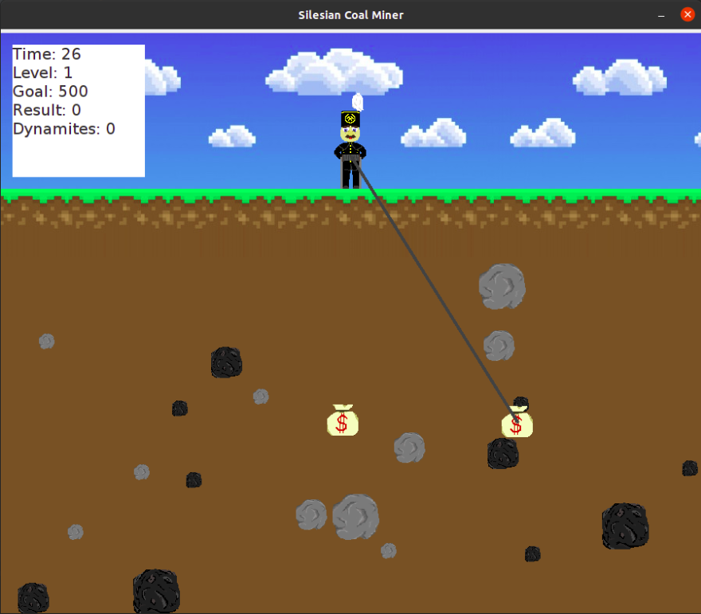

#Silesian Coal Miner
Simple game implemented during Object-Oriented Programming course at AGH UST. Game is based on famous Gold Miner, but
is nested in silesian reality. Player is coal miner, and his objective is to mine as many resources as he can, before 
the time is up. Each resource has different value, e.g. coal is more valuable than stone.
Game consists of levels. To level up, player has to collect required amount of money. Levels don't last forever and there
is limited time to accomplish it.
